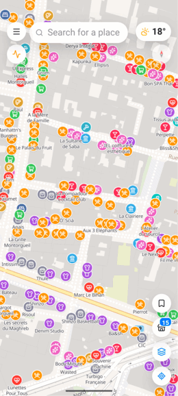
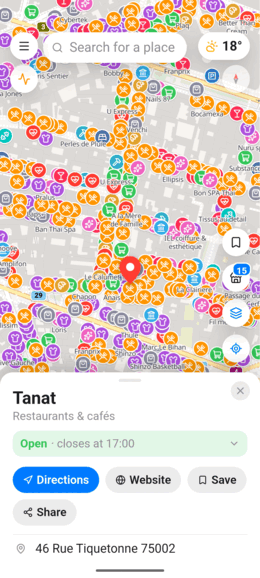
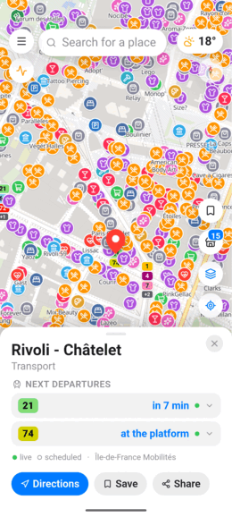
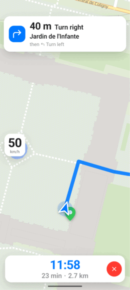
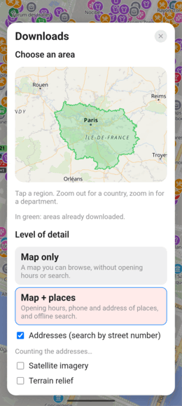
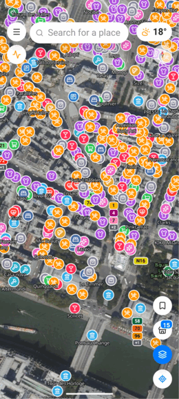

<div align="center">


# MY OSM

**A map that keeps your places to itself.**

Shops and opening hours, live public transport, step-by-step navigation and
offline maps — built on OpenStreetMap, with no account, no tracking, and
nothing sent to Google.

[](LICENSE)


*Français : [README.fr.md](README.fr.md)*

</div>

---

## Where to get it

| | |
| --- | --- |
| **Android** | [Releases](https://github.com/Gris-S/my-osm/releases) — install the APK directly |
| **F-Droid** | Submission in preparation — the app is already built to their rules: FOSS toolchain, no proprietary SDK, and **no API key baked into the build** |
| **Web** | Work in progress. The same codebase runs as an installable website, but it is not published yet |

It is **alpha** software: it works, it is used daily, and it still changes.

---

## What it looks like

<table>
<tr>
<td width="33%" align="center">
<br>
<b>Places, not clutter</b><br>
<sub>Shops, cafés, transport — read from the map tiles themselves, so they appear instantly.</sub>
</td>
<td width="33%" align="center">
<br>
<b>Open or closed, right now</b><br>
<sub>Opening hours, address, phone and website, with directions one tap away.</sub>
</td>
<td width="33%" align="center">
<br>
<b>Live departures</b><br>
<sub>Next departures at any stop, and whether each one is measured or timetabled.</sub>
</td>
</tr>
<tr>
<td width="33%" align="center">
<br>
<b>Drive with confidence</b><br>
<sub>Turn-by-turn driving with live traffic and speed limits — and whatever you are listening to, from any player.</sub>
</td>
<td width="33%" align="center">
<br>
<b>Take it offline</b><br>
<sub>Tap a country, a region or a department and keep it on the device.</sub>
</td>
<td width="33%" align="center">
<br>
<b>Satellite and terrain</b><br>
<sub>Aerial imagery, hillshading and contour lines, light or dark.</sub>
</td>
</tr>
</table>

---

## What it does

**Find places.** Shops, cafés, pharmacies, transport and more, classified into
16 categories you can switch on and off. Opening hours tell you whether a place
is open *now*, not just what its hours are. When OpenStreetMap doesn't know a
place, a built-in browser searches the web and brings the location back to the
map — without ever asking Google.

**Get there.** Walking, driving and public transport, plus a running mode with
its own pace chart. Driving navigation shows live traffic on your route, speed
limits, lane guidance and speed-camera warnings. Every trip you walk or run is
kept on the device, with its track and elevation profile, for as long as you
choose — or not at all.

**Ride.** Live departures worldwide through [Transitous](https://transitous.org/),
and in the Paris region through Île-de-France Mobilités. Journeys are followed
step by step: where to board, which direction, where to get off, which station
exit to take.

**Go offline.** Download a country, a region or a department: map tiles, place
details, the search index and street addresses are stored **inside the app**,
where the system cannot clear them. Browsing, search and place details then work
with no connection at all.

> **Honest limit:** route calculation still needs a connection. There is no
> routing engine on the device — the app says so plainly instead of failing
> silently.

**And the rest.** Weather, air quality, pollen and official French weather
warnings. Street-level photos from Mapillary. Saved places in colour-coded
folders. Home and work as one-tap destinations. Light and dark themes, the
latter following the phone's ambient light sensor. French and English.

---

## Why it exists

Because a map should not be the price of knowing where you are.

- **Nothing goes to Google.** No Firebase, no Analytics, no Play Services, no
  Google Maps. Android's cloud backup and device-to-device transfer are turned
  off for this app, and the WebView's own telemetry and Safe Browsing are
  disabled. The built-in web browser blocks every Google host outright.
- **No account, ever.** Nothing to sign up for, nothing to log into.
- **Your data stays on the phone.** Saved places, home and work addresses, trip
  history and downloaded maps never leave the device. There is no server to
  leave to.
- **Optional keys stay yours.** The free API keys some extras use are entered in
  the app (Menu › API) and stored on the device. They are **never compiled into
  a published build** — the release build refuses to start if one is set.
- **Free software.** GPL-3.0-or-later, source included, forks welcome.

---

## Data sources

Everything displayed belongs to its authors and follows its own licence; the app
credits them all under *Menu › Sources & licences*.

| | |
| --- | --- |
| Map data, places, stops | [OpenStreetMap](https://www.openstreetmap.org/copyright) contributors, ODbL |
| Vector tiles | [OpenFreeMap](https://openfreemap.org/) |
| Search & addresses | [Photon](https://photon.komoot.io/), [Base Adresse Nationale](https://adresse.data.gouv.fr/) |
| Routing | [OSRM](https://routing.openstreetmap.de/), TomTom (optional key) |
| Public transport | [Transitous](https://transitous.org/sources/), Île-de-France Mobilités (optional key) |
| Weather & air | [Open-Meteo](https://open-meteo.com/), Météo-France (optional key) |
| Imagery & terrain | Esri, [IGN](https://geoservices.ign.fr/), Mapzen/USGS/SRTM |
| Street photos | [Mapillary](https://www.mapillary.com/) (optional key) |

No key is required. Without them the app still works — public transport falls
back to Transitous everywhere, and the extras simply say what they are missing.

---

## Build it yourself

```bash
# Web version, in development
cd app && npm install && npm run dev

# Android APK (rebuilds the web app, then Android)
source ~/.local/share/android-env.sh
cd apk && npm install && npm run apk          # debuggable, for development
cd apk && npm run apk:release                 # the one you share
```

The web app lives in `app/` (React + Vite + MapLibre). `apk/` is nothing but the
Capacitor shell around it — **all code changes happen in `app/`**.

```
MY OSM/
├── app/         the source code           (README.md, CLAUDE.md inside)
├── apk/         the Android wrapper       (no app logic)
├── docs/        architecture and audits
└── outils/      backup and log helpers
```

### API keys

Optional free keys (Île-de-France Mobilités, TomTom, Mapillary, Météo-France) are
entered **in the app** (Menu › API), where they stay on the device and can be
changed without rebuilding.

`app/.env.local` also works for a local build (see `app/.env.example`) — but
anything named `VITE_*` is **compiled into the bundle**: whoever has the build
has the key. The shareable APK is therefore built with those variables blanked,
and the build **fails** if one of them is still set. Keys are never committed.

---

## Licence

MY OSM is free software under the **GNU General Public License v3.0 or later**
(see [LICENSE](LICENSE)). You may use, study, modify and redistribute it; any
modified version you distribute must stay under the same licence, source code
included.
