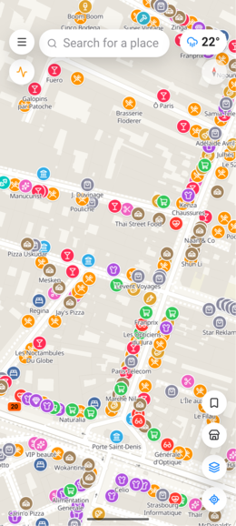
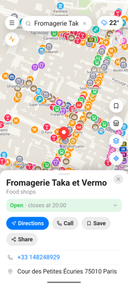
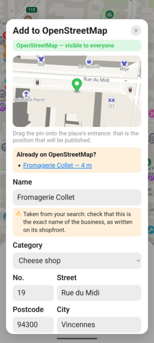
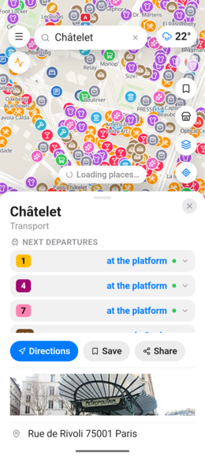
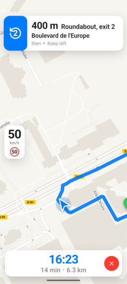
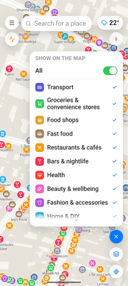
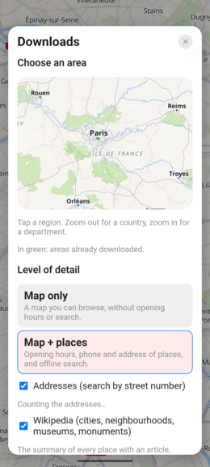
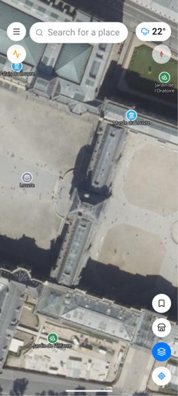
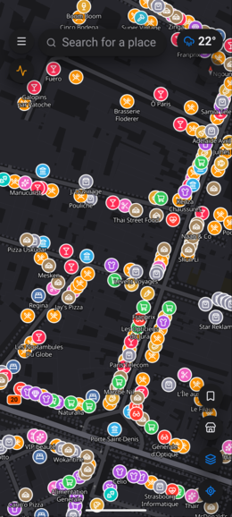

<div align="center">


# MY OSM

**A map that keeps your places to itself.**

Shops and opening hours, live public transport, step-by-step navigation and
offline maps — built on OpenStreetMap, with no account, no tracking, and
nothing sent to Google.

[](LICENSE)


*Français : [README.fr.md](README.fr.md)*

</div>

---

## Where to get it

| | |
| --- | --- |
| **Android** | [Releases](https://github.com/Gris-S/my-osm/releases) — install the APK directly |
| **F-Droid** | Submitted ([merge request !49227](https://gitlab.com/fdroid/fdroiddata/-/merge_requests/49227)), waiting for review. The build is reproducible: F-Droid will ship the very APK published here |
| **Docker** | `ghcr.io/gris-s/my-osm:latest` — the web version for larger screens, see [docker/README.md](docker/README.md) |

It is **alpha** software: it works, it is used daily, and it still changes.

---

## What it looks like

<table>
<tr>
<td width="33%" align="center">
<br>
<b>Places, not clutter</b><br>
<sub>Shops, cafés, transport — each pin says what the place is: a cheese, a fish, a croissant.</sub>
</td>
<td width="33%" align="center">
<br>
<b>Open or closed, right now</b><br>
<sub>Opening hours, address, phone and website, with directions one tap away.</sub>
</td>
<td width="33%" align="center">
<br>
<b>Add it to OpenStreetMap</b><br>
<sub>Found a shop the map didn't know? Check the pre-filled form, and the next person finds it.</sub>
</td>
</tr>
<tr>
<td width="33%" align="center">
<br>
<b>Live departures</b><br>
<sub>Next departures at any stop, and whether each one is measured or timetabled.</sub>
</td>
<td width="33%" align="center">
<br>
<b>Step by step</b><br>
<sub>Walking, cycling, driving and transit, with live traffic, speed limits and lane guidance on the road.</sub>
</td>
<td width="33%" align="center">
<br>
<b>Your map, your filter</b><br>
<sub>16 categories to switch on and off, from food shops to parking.</sub>
</td>
</tr>
<tr>
<td width="33%" align="center">
<br>
<b>Take it offline</b><br>
<sub>Tap a country, a region or a department and keep it on the device.</sub>
</td>
<td width="33%" align="center">
<br>
<b>Satellite and terrain</b><br>
<sub>Aerial imagery, hillshading and contour lines, light or dark.</sub>
</td>
<td width="33%" align="center">
<br>
<b>Day and night</b><br>
<sub>A dark theme that follows the phone's light sensor.</sub>
</td>
</tr>
</table>

---

## What it does

**Find places**
- 16 categories to switch on and off — groceries, food shops, restaurants, bars, health, beauty, fashion, home, culture, parks, sport, hotels, transport, parking…
- Each pin shows what the place is (a cheese for a cheese shop, a fish for a fishmonger…)
- Opening hours that say whether a place is open **now**
- Search with stations first, recent searches, home and work in one tap
- Places OpenStreetMap doesn't know: a built-in browser searches the web and brings the location back to the map — without ever asking Google
- Towns and neighbourhoods: outline, population, area, density; Wikipedia summaries and photos

**Give back to OpenStreetMap**
- A place found on the web can be **added to OpenStreetMap** from its card: pre-filled form, pin to place, duplicate check, confirmation before sending
- One-time sign-in, no password stored; off by default (Menu › Modes)

**Get there**
- Walking, cycling, driving and public transport
- Cycling: fastest or safest route side by side, bike lanes in green, worldwide and without a key
- Driving: live traffic on your route, speed limits, lane guidance, speed-camera warnings, toll prices where published
- Transit: live departures worldwide ([Transitous](https://transitous.org/)) and in the Paris region (Île-de-France Mobilités); journeys followed step by step, down to the station exit
- A running mode with its own pace chart
- Your music (any player) controllable during navigation
- Walks and runs kept on the device with track and elevation, for as long as you choose — or not at all

**Go offline**
- Download a country, a region or a department: map tiles, place details, search index, street addresses and Wikipedia, stored **inside the app**
- Browsing, search and place details then work with no connection

> **Honest limit:** route calculation still needs a connection. There is no
> routing engine on the device — the app says so plainly instead of failing
> silently.

**And the rest**
- Weather, air quality, pollen and official French weather warnings
- Satellite imagery, terrain relief, contour lines, 3D buildings, live traffic layer
- Street-level photos from Mapillary
- Saved places in colour-coded folders
- Light and dark themes, the dark one following the ambient light sensor
- English and French
- A Docker image for larger screens, with the same features except the running mode

---

## Why it exists

Because a map should not be the price of knowing where you are.

- **Nothing goes to Google.** No Firebase, no Analytics, no Play Services, no
  Google Maps. Android's cloud backup and device-to-device transfer are turned
  off for this app, and the WebView's own telemetry and Safe Browsing are
  disabled. The built-in web browser blocks every Google host outright.
- **No account needed.** Nothing to sign up for. The only sign-in is to your
  own OpenStreetMap account, and only if you choose to add places to it.
- **Your data stays on the phone.** Saved places, home and work addresses, trip
  history and downloaded maps never leave the device. There is no server to
  leave to.
- **Optional keys stay yours.** The free API keys some extras use are entered in
  the app (Menu › API) and stored on the device. They are **never compiled into
  a published build** — the release build refuses to start if one is set.
- **Free software.** GPL-3.0-or-later, source included, forks welcome.

---

## Data sources

Everything displayed belongs to its authors and follows its own licence; the app
credits them all under *Menu › Sources & licences*.

| | |
| --- | --- |
| Map data, places, stops | [OpenStreetMap](https://www.openstreetmap.org/copyright) contributors, ODbL |
| Vector tiles | [OpenFreeMap](https://openfreemap.org/) |
| Places the tiles leave out, place details | [Overpass API](https://wiki.openstreetmap.org/wiki/Overpass_API) (overpass-api.de, private.coffee) |
| Adding places | [OpenStreetMap API](https://wiki.openstreetmap.org/wiki/API_v0.6), with your own account |
| Search & addresses | [Photon](https://photon.komoot.io/), [Base Adresse Nationale](https://adresse.data.gouv.fr/) |
| Routing | [OSRM](https://routing.openstreetmap.de/), [Valhalla](https://github.com/valhalla/valhalla) and [BRouter](https://brouter.de/brouter/) for cycling, TomTom (optional key) |
| Public transport | [Transitous](https://transitous.org/sources/), Île-de-France Mobilités (optional key) |
| Weather & air | [Open-Meteo](https://open-meteo.com/), Météo-France (optional key) |
| Imagery & terrain | Esri, [IGN](https://geoservices.ign.fr/), Mapzen/USGS/SRTM |
| Street photos | [Mapillary](https://www.mapillary.com/) (optional key) |

No key is required. Without them the app still works — public transport falls
back to Transitous everywhere, and the extras simply say what they are missing.

---

## Build it yourself

```bash
# Web version, in development
cd app && npm install && npm run dev

# Android APK (rebuilds the web app, then Android)
source ~/.local/share/android-env.sh
cd apk && npm install && npm run apk          # debuggable, for development
cd apk && npm run apk:release                 # the one you share
```

The web app lives in `app/` (React + Vite + MapLibre). `apk/` is nothing but the
Capacitor shell around it — **all code changes happen in `app/`**.

```
MY OSM/
├── app/         the source code           (README.md, CLAUDE.md inside)
├── apk/         the Android wrapper       (no app logic)
├── docs/        architecture and audits
└── outils/      backup and log helpers
```

### API keys

Optional free keys (Île-de-France Mobilités, TomTom, Mapillary, Météo-France) are
entered **in the app** (Menu › API), where they stay on the device and can be
changed without rebuilding.

`app/.env.local` also works for a local build (see `app/.env.example`) — but
anything named `VITE_*` is **compiled into the bundle**: whoever has the build
has the key. The shareable APK is therefore built with those variables blanked,
and the build **fails** if one of them is still set. Keys are never committed.

---

## Support

MY OSM is free, has no ads and collects nothing. If it is useful to you, you can
[buy me a coffee](https://buymeacoffee.com/gris_) — entirely optional, and the
app works the same either way.

---

## Licence

MY OSM is free software under the **GNU General Public License v3.0 or later**
(see [LICENSE](LICENSE)). You may use, study, modify and redistribute it; any
modified version you distribute must stay under the same licence, source code
included.
