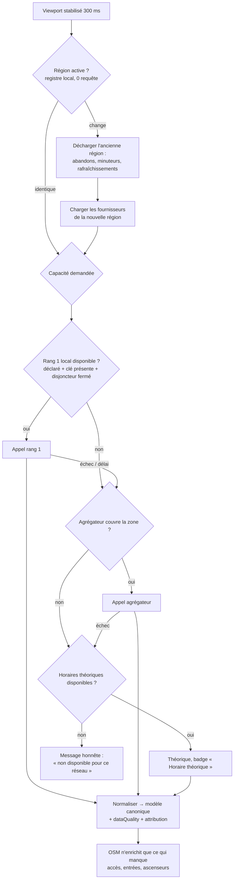
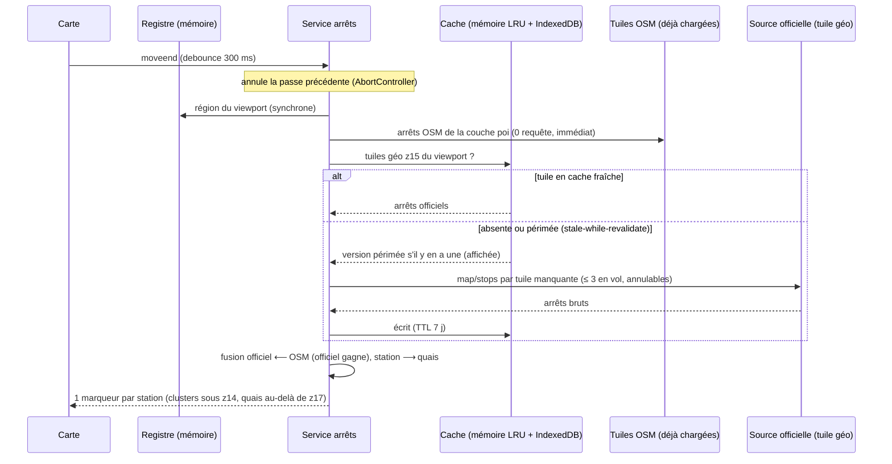
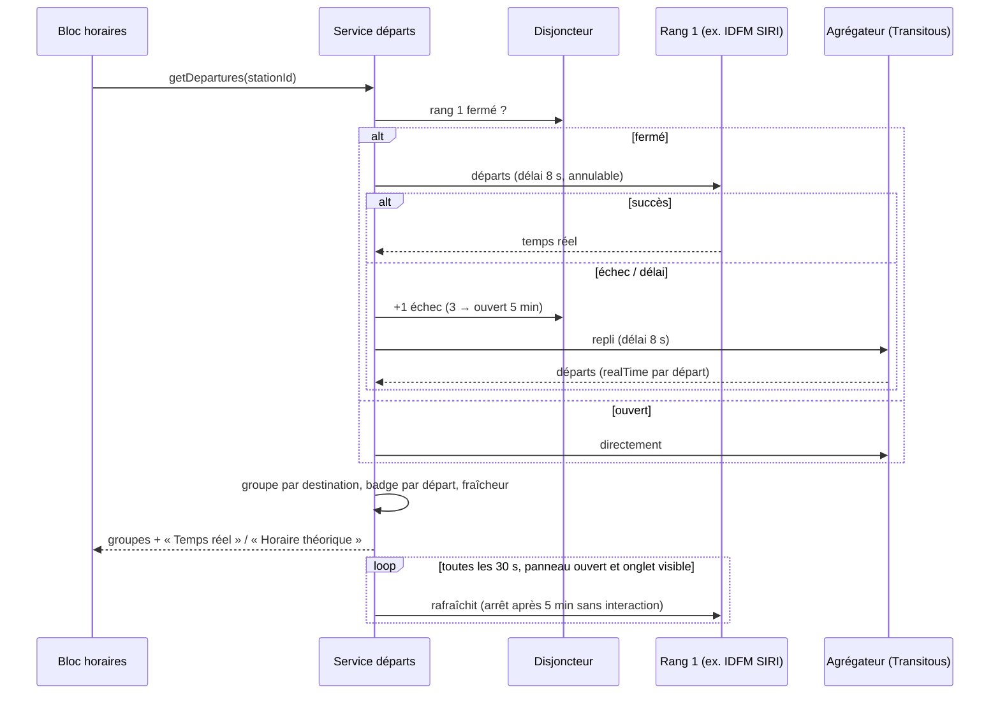
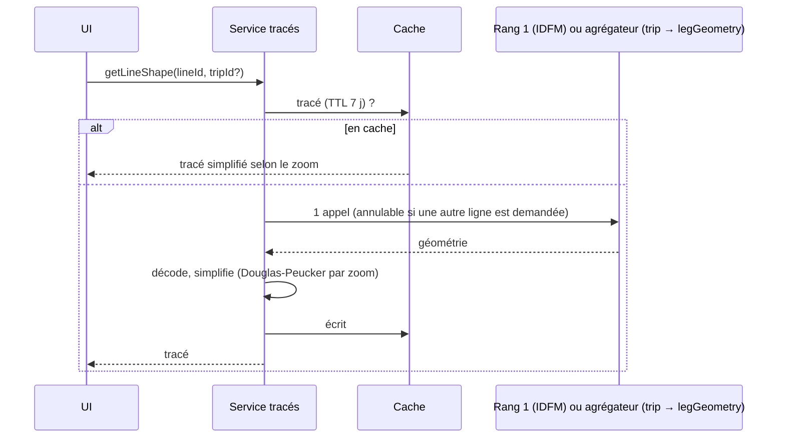

# Architecture de la couche API — plateforme transport universelle

> **Statut : proposition, en attente de validation.** Aucun code n'a été écrit.
> Branche `plateforme-transport`, partie de `main` (0.1.0-alpha.6).
> Relevés et appels réels du 15 septembre 2026.

## 0. Cadre

### 0.1 Décisions déjà prises (réponses du 15 septembre 2026)

| # | Question | Décision |
|---|---|---|
| 1 | Proxy / clés | **Pas de proxy pour l'instant.** Sources sans clé appelées **depuis le natif** (pour fixer le `User-Agent`) ; clés d'API inchangées (compilées) jusqu'à la sortie officielle. |
| 2 | Arrêts sur la carte | « Au mieux » : voir §3.4 — hybride mesuré. |
| 3 | Villes de test | À mon choix, sur couverture vérifiée : voir §2c. |
| 4 | Navigation guidée en transports | **Partout** où un itinéraire existe. |
| 5 | Hors ligne | **Non requis** : message honnête sans réseau. |
| 6 | Cibles | **APK seulement** pour l'instant. |
| 7 | Copie | Branche git `plateforme-transport` + sauvegarde `saves/…_46_avant-plateforme-transport`. |
| — | Licence | Dépôt **public sous GPL-3.0-or-later** (condition de Transitous) ; contact des `User-Agent` : **https://github.com/Gris-S/my-osm**. |

### 0.2 Écarts assumés avec le cahier des charges

- **§3.8 (aucune clé dans le front, proxy)** : non tenu pour l'instant (décision 1). La
  configuration reste externalisée (`.env.local`, `config.ts`) pour qu'un proxy se
  branche sans toucher aux adaptateurs : un adaptateur appelle un **transport HTTP
  injecté** (§3.9), qui pourra devenir « passer par le proxy ».
- **§5 Lighthouse / 3G simulée côté web** : la cible est l'APK. Mesures équivalentes
  sur l'appareil (DevTools par le câble : requêtes, mémoire, images, processeur).
- **§5 hors-ligne** : vérifié seulement sous l'angle « message honnête, aucun plantage ».

### 0.3 Contraintes du projet qui s'imposent à cette refonte

Tirées de `app/CLAUDE.md` ; les ignorer casserait des choses mesurées.

- Toutes les URL de service dans `config.ts` ; aucun texte d'interface en dur (fr/en).
- `App.tsx` détient l'état partagé, **sans store ni contexte** : registre et
  fournisseurs sont des **magasins de module** (patron de `useTheme`, `apiKeys`).
- `src/navigation/` doit rester **supprimable** : le modèle canonique vit **hors** de
  ce dossier (`src/transport/`), la navigation n'en est qu'un consommateur.
- Aucune donnée pour Google ; CSP en production (`security.ts`) : `connect-src https:`
  suffit, mais **les appels natifs** (CapacitorHttp) ne passent pas par la CSP.
- Le Service Worker ne met aucune API en cache (sans objet dans l'APK, qui n'en a pas).
- Arrêts actuels lus **dans les tuiles vectorielles** (0 requête, ~7 ms) : c'est un
  acquis de performance à ne pas perdre (§3.4).

---

## 1. Référence Paris (avant refonte)

Capturée sur Pixel 8, APK debug 0.1.0-alpha.6, par le câble (DevTools), captures
d'écran dans `docs/reference-paris/` (**locales**, exclues du dépôt : la position de
l'appareil y est visible).

**Fonctionnalités à préserver à l'identique** (liste issue du code et de `app/CLAUDE.md`) :

1. Arrêts ferrés et stations visibles dès le zoom de la carte ; arrêts de bus à partir
   du zoom 15 ; fusion des arrêts de même nom et même mode à moins de 300 m.
2. Pastilles de lignes sur les arrêts (3 au plus, puis « + N »), couleurs officielles
   IDFM, rattachement par mode (poteau le plus proche pour le bus, zone pour le ferré).
3. Fiche d'un arrêt : prochains passages SIRI Lite (PRIM), **groupés par terminus**,
   5 par ligne, cache 30 s, lignes « silencieuses » du référentiel affichées en retrait.
4. Clic sur une ligne → tracé de la ligne à sa couleur (cache mémoire de 8 lignes).
5. Itinéraire en transports (Navitia via PRIM) : jusqu'à 3 trajets, tronçon par tronçon
   pour les étapes, départs suivants au dépli, cache 60 s, message hors Île-de-France.
6. Navigation guidée en transports : actions monter/descendre, horloge, recalage GPS,
   sortie de station conseillée (jeu « accès » IDFM).

**Mesures** (15 septembre 2026, vers 17 h, Wi-Fi ; « requêtes » = appels réseau
externes pendant le parcours, tuiles de fond de carte comprises) :

| Parcours | Temps jusqu'à l'affichage | Requêtes | Détail |
|---|---|---|---|
| 1. Carte au démarrage (rechargement) | 2 338 ms | 18 | 10 tuiles, météo 2, BAN 2, Météo-France 3, référentiel IDFM 1 |
| 2. Arrêts visibles, Châtelet zoom 16 | 626 ms à froid · **62 ms** au cache chaud | 7 à froid · **0** au cache chaud | **6 marqueurs**, tous avec pastilles ; 1 nom répété (« Châtelet » : métro 1-4-7 et bus N16, arrêts réellement distincts) |
| 3. Clic sur « Châtelet - Les Halles » → fiche + horaires | **654 ms** | 11 | IDFM ouvert 3, PRIM 2, Overpass 1, tuiles 5 ; 3 lignes (A, B, D) |
| 4. Ouverture d'une ligne → départs par destination + tracé | **549 ms** | 1 | tracé RER A (123 ko), 8 groupes par destination |
| 5. Itinéraire en transports, position → Gare de Lyon | **1 333 ms** | 3 | OSRM 1, PRIM (Navitia) 2 ; trajet 45 min, bus 112 puis RER A |

Ces cinq valeurs sont **le plancher de non-régression** : après refonte, chaque parcours
parisien doit être aussi rapide (tolérance de mesure ±20 %) et ne pas demander plus de
requêtes. Captures correspondantes dans `docs/reference-paris/` (locales).

---

## 2. Livrable 1 — cartographie

### 2a. Inventaire des sources

Colonne « vérif. » : **A** = appel réel effectué et réponse lue ; **D** = documentation
officielle lue ; **S** = seulement des sources secondaires (à confirmer avant tout code).

| Source | Couverture | Capacités | Clé | Quota | Licence / conditions | Attribution | Fiabilité constatée | Vérif. |
|---|---|---|---|---|---|---|---|---|
| **IDFM PRIM** — SIRI Lite `stop-monitoring` | Île-de-France | départs temps réel | oui | 1 000 appels/jour (partagé avec Navitia) | conditions PRIM | IDFM | en production, stable | A (déjà en service) |
| **IDFM PRIM** — Navitia | Île-de-France | itinéraires, départs suivants par quai | oui (même) | même quota | idem | IDFM | stable ; hors IDF, trajets à pied | A |
| **IDFM données ouvertes** (référentiel lignes, `arrets-lignes`, tracés, `acces`) | Île-de-France | lignes, couleurs, arrêts, tracés, sorties | non | non annoncé | licence IDFM open data | IDFM | stable | A |
| **Transitous** (MOTIS 2, `api.transitous.org/api/`) | ~1 800 flux, dizaines de pays ; vérifié à Paris, Amsterdam, Los Angeles, Tokyo, São Paulo, Sydney, Genève | arrêts par zone, départs (+ quai, annulations, perturbations), trajet et tracé, itinéraires, géocodage inverse | **non** | aucun chiffre ; « léger sur nos ressources », **cache obligatoire**, **contact avant usage intensif** | **projet open source**, non commercial, `User-Agent` (nom, version, contact), lien visible vers transitous.org/sources, OSM | sources par pays (CC-BY, CC-BY-SA, ODbL) | réponses en < 2 s ; temps réel inégal ; couleurs et noms de lignes parfois absents | **A** + D |
| **OVapi** (KV78Turbo, `v0.ovapi.nl`) | Pays-Bas | départs temps réel par `stopareacode` / `tpc` | non | usage raisonnable ; licence KV78Turbo pour usage intensif | **GOVI : ne pas stocker plus de 30 min** | OpenOV | — | S |
| **opentransportdata.swiss** (OJP, GTFS-RT) | Suisse | départs, itinéraires, temps réel | oui (API Manager) | gratuit sous un plafond | conditions OTD | SBB / OTD | — | D (partielle) |
| **TfNSW Open Data** (Trip Planner, GTFS-RT) | Nouvelle-Galles du Sud | arrêts, départs, itinéraires, perturbations | oui | — | licence TfNSW | TfNSW | — | S |
| **ODPT** | Japon (Tokyo…) | lignes, horaires, temps réel selon opérateurs | oui (inscription) | — | conditions par jeu de données | ODPT / opérateurs | — | S |
| **SPTrans Olho Vivo** | São Paulo | positions, prévisions d'arrivée | oui (jeton) | — | conditions SPTrans | SPTrans | — | S |
| **LA Metro API** | Los Angeles | GTFS statique et temps réel (via Swiftly) | selon point d'accès | — | conditions LA Metro | LA Metro | — | S |
| **Navitia.io** (public) | France, quelques régions | itinéraires, départs, géométries | **jeton via l'autorité organisatrice** | non publié | — | opérateurs | inscription libre fermée | D |
| **Transitland v2** | mondial | départs (statique + RT), itinéraires (bêta) | oui | offre gratuite « faible débit » ; itinéraires 1 000/mois | Interline | flux | — | D |
| **Mobility Database** | mondial (catalogue) | catalogue de flux GTFS / GTFS-RT, emprises | compte + jeton | — | conditions MobilityData | — | utile au **registre**, pas à l'exécution | D |
| **transport-apis** (registre CC0) | ~100 API décrites | emprises, protocoles, clés | — | — | CC0 | — | inspiration du format du registre | D |
| **OSM / tuiles OpenFreeMap** | mondial | couche `poi` (arrêts, stations), rendu | non | usage raisonnable | ODbL | © OpenStreetMap | déjà en service, 0 requête supplémentaire | A |
| **Overpass** | mondial | détails OSM, accès, ascenseurs, entrées | non | serveurs publics limités | ODbL | © OSM | lent, parfois en panne (déjà mesuré) | A |
| **Photon** (komoot) | mondial | géocodage, recherche | non | « fair use », limitation si abus | ODbL | © OSM | déjà en service | D |
| **Nominatim** (OSMF) | mondial | géocodage inverse (contours) | non | **1 requête/s max**, pas d'autocomplétion | ODbL, `User-Agent` requis | © OSM | déjà en service (zones hors ligne) | D |

**Constats des appels réels à Transitous** (15 septembre 2026, 13 appels au total) :

- `GET /api/v5/stoptimes?center=lat,lon&radius=m&n=N` : champs `mode`, `realTime`,
  `headsign`, `routeShortName`, `routeColor`, `routeTextColor`, `displayName`,
  `agencyName`, `tripId`, `cancelled`, `tripCancelled`, `source` ; `place` porte
  `stopId`, **`parentId`** (souvent), `departure`, `scheduledDeparture`, `track`,
  `scheduledTrack`, **`alerts`** (GTFS-RT `headerText`, `descriptionText`, périodes).
- `GET /api/v1/map/stops?min=lat,lon&max=lat,lon` : liste plate `name`, `stopId`,
  `parentId` (parfois), `lat`, `lon`, `level`, `modes`, `importance`.
  **Doublons inter-flux** : 80 arrêts pour Amsterdam Centraal (DELFI, Eurostar,
  chemins de fer autrichiens et belges…), 22 dont 20 quais « Châtelet » à Paris.
- `GET /api/v5/trip?tripId=…` : itinéraire d'une course, `legGeometry`
  (**polyline encodée, précision 6**), `intermediateStops`. **Pas de tracé par ligne** :
  le tracé d'une ligne se déduit d'une course représentative.
- `GET /api/v5/plan?fromPlace=lat,lon&toPlace=lat,lon&numItineraries=N` : itinéraires,
  jambes avec `mode`, `routeShortName`, `routeColor`, `realTime`, `legGeometry`, `steps`.
- `GET /api/v1/reverse-geocode?place=lat,lon&type=STOP` : arrêts proches.
- Qualité par ville (échantillon de départs) : Paris 14/16 temps réel, couleurs,
  6 perturbations ; Sydney 8/8, couleurs ; Genève 11/11, **sans couleurs** ;
  São Paulo **0/14 (théorique)**, couleurs ; Tokyo partiel, **noms de ligne parfois
  numériques** (`9602451`) ; Amsterdam : échantillon théorique ; Los Angeles temps réel,
  couleurs sur le ferré seulement.
- Versions : l'OpenAPI annonce jusqu'à v6 ; les appels vérifiés sont en **v1 et v5**.
  Le choix de version sera figé à l'implémentation après un appel de contrôle.

### 2b. Modèle de données canonique

Dans `app/src/transport/model.ts`. Tout objet renvoyé par un adaptateur est de ces
types ; aucun composant ne voit une réponse brute.

```ts
type DataQuality = "realtime" | "scheduled" | "estimated" | "unknown";

/** Commun à tout objet : d'où il vient, ce qu'il vaut, quand, et qui citer. */
interface Provenance {
  source: ProviderId;            // "idfm-prim", "transitous", "osm-tiles"…
  dataQuality: DataQuality;
  fetchedAt: number;             // ms epoch
  attribution: AttributionId;    // renvoie à une entrée « Sources et licences »
  originIds: string[];           // identifiants d'origine conservés après fusion
}

type TransitMode = "metro" | "tram" | "bus" | "rail" | "regional-rail" | "ferry"
  | "funicular" | "cable" | "coach" | "other";

interface Place extends Provenance { id: string; name: string; lat: number; lon: number; }

interface Station extends Provenance {     // parent, un marqueur sur la carte
  id: CanonicalId; name: string; lat: number; lon: number;
  modes: TransitMode[]; quays: Quay[]; lines: LineRef[]; regionId: RegionId;
}
interface Quay extends Provenance {        // enfant : quai, poteau, voie
  id: CanonicalId; stationId: CanonicalId; name: string; lat: number; lon: number;
  modes: TransitMode[]; code?: string;     // « 10a », « K »
}
interface Line extends Provenance {
  id: CanonicalId; shortName: string; longName?: string; mode: TransitMode;
  color?: string; textColor?: string;      // absents → repli par mode (§3.4)
  operator?: string;
}
interface Route extends Provenance { id: CanonicalId; lineId: CanonicalId; direction?: string; shape?: Shape; }
interface Trip extends Provenance { id: string; lineId: CanonicalId; headsign: string; stops: TripStop[]; shape?: Shape; }
interface Departure extends Provenance {
  lineId: CanonicalId; quayId?: CanonicalId; destination: string;
  scheduledAt: number; expectedAt?: number;          // expectedAt seulement si realtime
  platform?: string; cancelled: boolean; tripId?: string;
}
interface DepartureGroup { destination: string; lineId: CanonicalId; departures: Departure[]; }
interface Journey extends Provenance { legs: JourneyLeg[]; departAt: number; arriveAt: number; transfers: number; }
interface Alert extends Provenance {
  scope: { lineIds?: CanonicalId[]; stationIds?: CanonicalId[] };
  title: string; text: string;           // texte brut : tout HTML retiré à la normalisation
  activePeriods: { start: number; end?: number }[];
}
```

**Identifiants canoniques** : `<région>:<type>:<clé>` ; la clé est l'identifiant de la
source **de plus haut rang** qui a fourni l'objet (`paris:station:IDFM:71264`), sinon un
hachage stable du nom normalisé et de la position arrondie à 50 m. Les identifiants de
toutes les sources fusionnées restent dans `originIds`.

### 2c. Matrice de capacités par région (vérifiée ou à vérifier)

Régions de test retenues (profils du §5 du cahier des charges) :

| Région | Profil | Arrêts | Fiche / départs | Temps réel | Tracé | Itinéraire | Perturbations | Rang 1 local |
|---|---|---|---|---|---|---|---|---|
| **Paris** (IDF) | non-régression | tuiles OSM + référentiel IDFM | **IDFM PRIM** | IDFM (Transitous en repli : 14/16) | IDFM | **Navitia PRIM** (Transitous en repli) | Transitous (IDFM n'en fournit pas via SIRI Lite) | IDFM |
| **Amsterdam** | temps réel attendu, plusieurs opérateurs | Transitous `map/stops` | Transitous | **à vérifier** (échantillon théorique) → OVapi en rang 1 | Transitous `trip` | Transitous | Transitous (vu) | OVapi (sans clé, 30 min) |
| **Los Angeles** | plusieurs opérateurs, Amérique | Transitous | Transitous | oui (vu) | Transitous | Transitous | à vérifier | LA Metro (clé) — non requis |
| **Tokyo** | alphabet non latin, Asie | Transitous | Transitous | partiel (vu) | Transitous | Transitous (vu, noms numériques) | à vérifier | ODPT (clé) — **qualité des noms en question** |
| **São Paulo** | sans temps réel, Amérique du Sud | Transitous | Transitous | **non** (0/14) | Transitous | à vérifier | non vu | SPTrans (jeton) — non requis |
| **Sydney** | temps réel, Océanie | Transitous | Transitous | oui (8/8) | Transitous | à vérifier | oui (vu) | TfNSW (clé) — non requis |
| **Genève** | frontalière (CH/FR) | Transitous | Transitous | oui (11/11) | Transitous | à vérifier (trajets CH↔FR) | à vérifier | opentransportdata.swiss (clé) |
| **Ailleurs** | repli mondial | Transitous si couvert, sinon tuiles OSM seules | Transitous si couvert | selon flux | selon flux | selon flux | selon flux | — |

« À vérifier » = un appel réel reste à faire **avant** d'écrire l'adaptateur concerné.

### 2d. Arbre de décision et parcours critiques

#### Choix du fournisseur, par capacité



#### Parcours 1 — Déplacement de la carte → arrêts visibles



Dépendances : la région précède tout ; OSM est affiché immédiatement, l'officiel le
remplace à l'arrivée **sans réordonner** les pastilles déjà posées (clé de tri stable).
Conflit : **l'officiel gagne** sur la position et le nom ; OSM ne crée jamais un arrêt
qui a un équivalent officiel à moins de 50 m.

#### Parcours 2 — Clic sur une station → fiche

```mermaid
sequenceDiagram
  participant UI as Fiche station
  participant St as Service stations
  participant Cache
  participant Lines as Lignes (rang 1 ou agrégateur)
  UI->>St: getStationDetails(canonicalId)
  St->>Cache: station + quais + lignes ?
  alt en cache (TTL 1 j)
    Cache-->>UI: fiche immédiate
  else
    St->>Lines: lignes desservies (1 appel, annulable à la fermeture)
    Lines-->>St: lignes normalisées
    St->>Cache: écrit
    St-->>UI: fiche
  end
  Note over UI: la fiche s'ouvre sans attendre ;<br/>les pastilles s'ajoutent à l'arrivée
  UI->>UI: déclenche le parcours 3 (horaires) — rien n'est pré-chargé avant le clic
```

#### Parcours 3 — Horaires groupés par destination



Conflit entre deux sources pour un même départ : **le temps réel gagne** sur le
théorique ; à qualité égale, le rang le plus élevé. Un départ n'est jamais marqué
« Temps réel » si sa source ne l'affirme pas explicitement.

#### Parcours 4 — Tracé d'une ligne



Sans rang 1, le tracé vient d'une **course représentative** (`trip` de l'agrégateur, à
partir du `tripId` d'un départ déjà affiché) : **aucun appel supplémentaire** pour
trouver la course.

#### Parcours 5 — Itinéraire A → B

```mermaid
sequenceDiagram
  participant UI as Panneau itinéraire
  participant J as Service itinéraires
  participant Reg as Registre
  participant R1 as Moteur local (Navitia PRIM à Paris)
  participant R2 as Agrégateur (Transitous plan)
  UI->>J: planJourney(A, B, heure)
  J->>Reg: régions de A et de B
  alt même région avec moteur de rang 1
    J->>R1: calcul (délai 20 s, annulable à chaque modification)
    R1-->>J: trajets
  else régions différentes, ou pas de moteur local, ou échec
    J->>R2: plan (1 appel, plusieurs trajets)
    R2-->>J: trajets
  end
  J->>J: normalise, qualité par jambe, attribution
  J-->>UI: 3 trajets max ou message honnête « aucun moteur ne couvre ce trajet »
  Note over UI,J: cache 60 s par (A, B, minute) ; navigation guidée sur le trajet retenu
```

### 2e. Priorités et replis

Par **capacité**, pas par fournisseur :

| Capacité | Rang 1 | Rang 2 | Rang 3 | Rang 4 | Repli affiché |
|---|---|---|---|---|---|
| Arrêts (position, nom) | référentiel officiel local (IDFM) | agrégateur (`map/stops`) | GTFS statique de la région (via agrégateur) | tuiles OSM | aucun : les arrêts OSM restent affichés |
| Hiérarchie station → quais | `parent_station` / `StopPlace` officiel | `parentId` agrégateur | regroupement spatial + nom | relations OSM `stop_area` | — |
| Lignes, couleurs | référentiel officiel | agrégateur (`routeColor`) | — | tags OSM `colour`, `ref` | couleur par mode |
| Départs temps réel | API locale | agrégateur (`realTime: true`) | — | — | bascule théorique **annoncée** |
| Départs théoriques | API locale | agrégateur | GTFS statique | — | « Horaires non disponibles pour ce réseau » |
| Tracés | officiel | agrégateur (`trip`) | — | relations OSM `route` | pas de tracé, sans erreur |
| Perturbations | officiel | agrégateur (`alerts`) | — | — | rien affiché (pas de faux « aucune ») |
| Itinéraires | moteur local | agrégateur (`plan`) | — | — | message honnête |
| Accès, entrées, ascenseurs | officiel (ex. `acces` IDFM) | — | — | OSM (Overpass) | — |

**Délais, reprises, disjoncteur** (par fournisseur × capacité) :

| Capacité | Délai | Reprises (GET idempotents, jamais sur 4xx) | Disjoncteur |
|---|---|---|---|
| Départs | 8 s | 1, après 1 s | 3 échecs → ouvert 5 min → 1 essai |
| Arrêts par tuile | 10 s | 2, 1 s puis 4 s | 3 échecs → 10 min |
| Tracés | 10 s | 1 | 3 échecs → 10 min |
| Itinéraires | 20 s | 0 (l'utilisateur relance) | 2 échecs → 5 min |
| 429 reçu | — | aucune ; respect de `Retry-After` | ouvert jusqu'à `Retry-After` |

### 2f. Politique de cache

Mémoire LRU (plafond 8 Mo) + IndexedDB (clé `région:capacité:paramètres`),
*stale-while-revalidate* sauf mention contraire. **Rien n'est rafraîchi en arrière-plan
hors du panneau ouvert.**

| Donnée | TTL | Persistance | Justification |
|---|---|---|---|
| Registre des régions | version de l'app | embarqué | fichier statique de quelques ko |
| Arrêts par tuile géo | 7 jours | IndexedDB | les arrêts changent au mieux chaque saison ; Transitous exige le cache |
| Station, quais, lignes desservies | 1 jour | IndexedDB | renumérotations rares, mais réelles |
| Référentiel de lignes (noms, couleurs) | 7 jours | IndexedDB | à Paris déjà persistant, inchangé |
| Tracés de lignes | 7 jours | IndexedDB | géométrie lourde et stable |
| Départs temps réel | 30 s | **mémoire seulement** | au-delà, faux ; identique à Paris aujourd'hui |
| Départs d'une source OVapi | ≤ 30 s | mémoire seulement | licence GOVI : jamais plus de 30 min, et 30 s suffit |
| Départs théoriques | 5 min | mémoire | un horaire planifié ne bouge pas en 5 min |
| Perturbations | 5 min | mémoire | publiées à la minute au mieux |
| Itinéraires | 60 s, clé incluant la minute de départ | mémoire | identique à Paris |
| Géocodage (Photon) | 1 heure | mémoire | fair use Photon, saisies répétées |
| Résultat « non couvert » | 1 jour | IndexedDB | évite de redemander une zone vide |

Requêtes identiques en vol **partagées** (une seule part) ; concurrence plafonnée à
**4 appels simultanés par fournisseur** ; `If-None-Match` quand la source renvoie un
`ETag` (à vérifier par source).

### 2g. Budget de requêtes (engagement du code)

Compté en **appels réseau externes** (hors tuiles de fond de carte, qui existent déjà),
par interaction, vérifié par un test instrumenté (§5).

| Interaction | Budget max | Au cache chaud |
|---|---|---|
| Ouverture de l'app | 0 transport (registre embarqué) | 0 |
| Déplacement / zoom stabilisé | **3** (tuiles géo d'arrêts manquantes) | 0 |
| Clic sur une station (fiche) | **1** (lignes desservies) | 0 |
| Horaires (à l'ouverture de la fiche) | **2** (rang 1 + repli éventuel) | 1 |
| Rafraîchissement du temps réel | **1 / 30 s**, panneau ouvert seulement, arrêt après 5 min | — |
| Tracé d'une ligne | **1** | 0 |
| Itinéraire A → B | **1** hors Paris ; à Paris, 1 + nombre d'étapes (Navitia tronçon par tronçon, comme aujourd'hui, 16 au plus) | 0 |
| Changement de région | **0** vers l'ancienne région (abandons compris) | 0 |

---

## 3. Architecture cible

### 3.1 Registre des régions

`app/src/transport/regions.json`, embarqué, quelques ko. Format inspiré de
`public-transport/transport-apis` (CC0) :

```json
{
  "version": 1,
  "regions": [
    {
      "id": "paris",
      "name": { "fr": "Île-de-France", "en": "Île-de-France" },
      "bbox": [1.44, 48.12, 3.56, 49.24],
      "timezone": "Europe/Paris",
      "providers": [
        { "id": "idfm-prim", "rank": 1, "capabilities": ["departures", "journeys", "lines", "shapes", "stops", "exits"], "needsKey": "idfm" },
        { "id": "transitous", "rank": 2, "capabilities": ["stops", "departures", "shapes", "journeys", "alerts"] }
      ]
    },
    {
      "id": "world",
      "bbox": [-180, -90, 180, 90],
      "providers": [ { "id": "transitous", "rank": 2, "capabilities": ["stops", "departures", "shapes", "journeys", "alerts"] } ]
    }
  ]
}
```

- **Résolution** : la région la plus spécifique (plus petite emprise) contenant le
  centre du viewport ; hystérésis de 20 % pour ne pas basculer à la frontière.
- **Chargement paresseux** : chaque adaptateur est un import dynamique ; un
  fournisseur n'existe en mémoire que tant que sa région est active.
- **Déchargement** : abandon des requêtes, arrêt des minuteurs de rafraîchissement,
  vidage du cache mémoire de la région (IndexedDB conservé).
- **Critère de réussite** : ajouter une région = une entrée JSON (+ un adaptateur si le
  protocole est nouveau). Aucun autre fichier ne change.

### 3.2 Interface des adaptateurs

`app/src/transport/provider.ts` — celle du cahier des charges, avec deux ajouts :
`signal` sur chaque appel (annulation) et la qualité par objet (modèle §2b).

```ts
interface TransportProvider {
  id: ProviderId;
  capabilities(): Capability[];
  searchPlaces?(query: string, bbox: BBox, signal: AbortSignal): Promise<Place[]>;
  getStopsInViewport?(tile: GeoTile, signal: AbortSignal): Promise<Station[]>;
  getStationDetails?(station: StationRef, signal: AbortSignal): Promise<Station>;
  getDepartures?(station: StationRef, options: DepartureOptions, signal: AbortSignal): Promise<DepartureGroup[]>;
  getLineShape?(ref: { lineId: CanonicalId; tripId?: string }, signal: AbortSignal): Promise<Shape | null>;
  getStopsOfLine?(lineId: CanonicalId, signal: AbortSignal): Promise<Quay[]>;
  getAlerts?(scope: AlertScope, signal: AbortSignal): Promise<Alert[]>;
  planJourney?(from: LonLat, to: LonLat, options: JourneyOptions, signal: AbortSignal): Promise<Journey[]>;
}
```

`StationRef` (ajout de l'implémentation) : la station **telle que touchée sur la
carte** — identifiant, nom, position et lieu OSM d'origine. Un identifiant seul ne
suffisait pas : IDFM résout sa zone d'arrêt par la position, le nom et la nature
de l'arrêt OSM, et Transitous interroge autour de la position.

Adaptateurs prévus : `idfm` (reprise **à comportement identique** de `idfm.ts`,
`idfmNetwork.ts`, `transit.ts`), `transitous` (MOTIS 2), puis, sur demande et après
vérification : `ovapi`, `otd-swiss`, `tfnsw`, `odpt`.

### 3.3 Chaîne de priorité

Tableau §2e, appliqué par un **orchestrateur** (`transport/orchestrator.ts`) qui seul
connaît rangs, disjoncteurs et replis ; les adaptateurs ne se connaissent pas entre eux.
Chaque résultat remonte sa `dataQuality` à l'interface.

### 3.4 Déduplication et marqueurs

**Arrêts : hybride**, pour garder l'acquis parisien (0 requête) tout en donnant la
priorité à l'officiel :

1. Les tuiles OSM donnent **immédiatement** les arrêts (comme aujourd'hui).
2. À partir du zoom 15, l'orchestrateur demande les arrêts officiels **par tuile géo
   z15** (cache 7 jours), au plus 3 tuiles en vol.
3. **Fusion** (fonction pure testée) :
   - index spatial en grille de 50 m ;
   - noms normalisés : casse, accents, ponctuation, abréviations (`St`/`Saint`,
     `Pl.`/`Place`, `Gare de`, `Station`, `Centraal`/`Central`…), partie latine d'un
     nom bilingue (« 東京 Tōkyō » ⇔ « 東京 ») ;
   - modes compatibles (un bus ne fusionne pas avec un métro, sauf station multimodale
     déclarée par `parentId`) ;
   - regroupement station → quais par `parentId` / `parent_station`, sinon spatial ;
   - **l'officiel gagne**, OSM n'ajoute que ce qui n'a pas d'équivalent à 50 m.
4. **Un marqueur par station** ; quais au-delà du zoom 17 ou dans la fiche ; clusters
   MapLibre sous le zoom 14 ; aucun arrêt de bus sous le zoom 15 (réglage actuel).
5. **Icônes** : le système actuel (catégories de `filters.ts`, pastilles de lignes
   dessinées sur canvas) est conservé ; la pastille se génère à partir de
   `shortName` + `color`/`textColor`. Nom absent ou numérique → `displayName`, puis
   pictogramme du mode ; couleur absente → **couleur par mode** (palette fixe, testée
   pour le contraste).

À Paris, l'adaptateur IDFM garde sa règle de rattachement mesurée (poteau le plus
proche pour le bus, zone pour le ferré, nom exact jusqu'à 250 m).

### 3.5 Performance

Engagements du cahier des charges repris tels quels (debounce 300 ms, annulation,
aucun pré-chargement d'horaires, temps réel du seul panneau ouvert, pause quand
l'application passe en arrière-plan, arrêt après 5 min d'inactivité, cache à deux
niveaux, déduplication en vol, concurrence plafonnée, tracés simplifiés, rendu
vectoriel MapLibre, listes virtualisées au-delà de 50 lignes).
S'y ajoutent les règles de performance déjà mesurées dans le projet (aucune horloge au
niveau d'`App`, `setData` seulement si la liste change, composants `memo`).

### 3.6 Temps réel et théorique à l'écran

Badge unique par horaire (« Temps réel · il y a 12 s » / « Horaire théorique »), mention
de réseau quand le temps réel n'existe pas, groupes par destination, perturbations en
texte brut. Aucune source nommée dans l'interface principale ; **« Sources et
licences »** dans le menu burger, avec le lien exigé vers transitous.org/sources et les
attributions OSM. Textes en fr et en.

### 3.7 Itinéraires et navigation guidée

Parcours 5 ; la navigation guidée en transports (`useTransitNavigation`) consomme le
`Journey` canonique au lieu du `TransitJourney` Navitia — **partout** (décision 4).
Les sorties de station restent une capacité (`exits`) que seul IDFM fournit.

### 3.8 Sécurité (sans proxy)

- Appels vers les sources sans clé **par le natif** (`CapacitorHttp`) avec
  `User-Agent: MY-OSM/<version> (+https://github.com/Gris-S/my-osm)` — une WebView ne
  peut pas fixer son `User-Agent`. Correction au passage : Photon et Nominatim sont
  aujourd'hui appelés depuis la WebView sans `User-Agent` dédié.
- Liste blanche d'hôtes par fournisseur dans le registre ; tout paramètre (bbox,
  identifiants) validé et borné avant l'appel ; réponses plafonnées en taille.
- HTML des perturbations **retiré** à la normalisation (texte seul) ; aucune position de
  l'utilisateur envoyée aux sources d'horaires (seuls arrêts et zones visibles).
- Clés : inchangées (décision 1) ; le transport HTTP injecté (§3.9) permettra un proxy.

### 3.9 Transport HTTP injecté

Chaque adaptateur reçoit un `HttpClient` (natif + `User-Agent`, délais, taille max,
disjoncteur, déduplication en vol). Tests : un faux client rejoue des réponses
enregistrées (appels réels du §2a, anonymisés) — **aucun test ne touche le réseau**.

---

## 4. Plan d'implémentation proposé (après validation)

Commits atomiques, version incrémentée à chaque étape, Paris revérifié à chaque étape.

1. `transport/` : modèle canonique, registre, orchestrateur, `HttpClient`, disjoncteur,
   cache — sans aucun changement visible.
2. Adaptateur **IDFM** derrière l'interface ; composants branchés sur l'orchestrateur ;
   **mesure de non-régression Paris** (mêmes parcours que §1).
3. Adaptateur **Transitous** : départs, tracés, itinéraires, perturbations.
4. Arrêts hybrides et fusion ; un marqueur par station ; clusters ; pastilles génériques.
5. Badges temps réel / théorique, mention réseau, « Sources et licences ».
6. Navigation guidée sur `Journey` canonique, partout.
7. Villes de test (Paris, Amsterdam, Los Angeles, Tokyo, São Paulo, Sydney, Genève),
   mesures, audit, `docs/AUDIT.md`.

---

## 5. Points à valider

1. **Arrêts hybrides** (§3.4) : tuiles OSM immédiates + officiel par tuile géo à partir
   du zoom 15 (budget 3 appels par déplacement, 0 au cache chaud). D'accord ?
2. **Paris** : IDFM reste rang 1 pour départs, lignes, tracés, itinéraires, sorties ;
   Transitous sert de **repli** (quota PRIM épuisé, panne) et de source de
   **perturbations**. D'accord ?
3. **Tokyo** : via Transitous, certains noms de lignes sont des codes internes. On
   l'accepte avec le repli `displayName` / pictogramme, ou on prévoit l'adaptateur ODPT
   (clé à créer) ?
4. **Amsterdam** : l'échantillon Transitous était théorique. Adaptateur OVapi (sans clé,
   données gardées 30 s au plus) dans le périmètre de cette refonte, ou plus tard ?
5. **Transitous demande d'être contacté avant un usage important** (Matrix). Je propose
   de le faire avant la sortie officielle, pas pendant le développement. D'accord ?
6. **Le budget de requêtes (§2g)** te convient-il comme engagement contractuel ?
